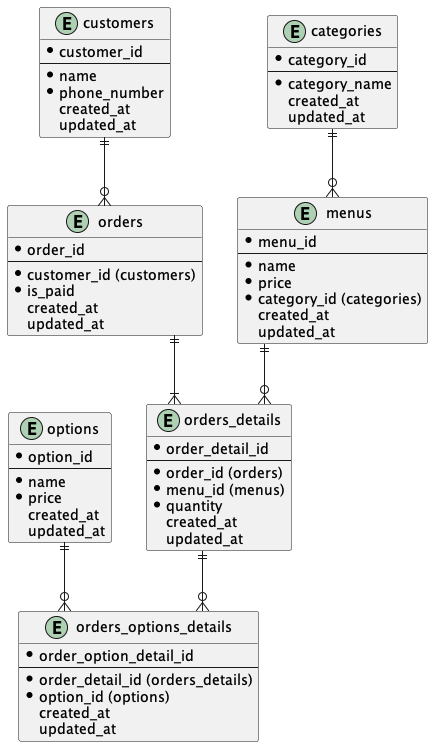

# 解答

## マスタ
- customers: 顧客リスト
  > 顧客データを保持する
  - **customer_id: 顧客ID**
  - name: 顧客名
  - phone_number: 電話番号
  - created_at: レコード登録日
  - updated_at: レコード更新日
- categories: カテゴリーリスト
  > カテゴリーデータ(盛り込み、にぎり、お好みすし・・・など)を保持する
  - **category_id: カテゴリーID**
  - category_name: カテゴリー名
  - created_at: レコード登録日
  - updated_at: レコード更新日
- menus: メニューリスト
  > メニューデータ(セットメニュー&単品メニュー)を保持する
  - **menu_id: メニューID**
  - name: メニュー名
  - price: 単価
  - category_id: カテゴリーID(カテゴリーリスト)
  - created_at: レコード登録日
  - updated_at: レコード更新日
- options: オプションリスト
  > オプションデータ(さび抜き、化粧箱付き、・・・など)を保持する
  - **option_id: オプションID**
  - name: オプション名
  - price: 単価
  - created_at: レコード登録日
  - updated_at: レコード更新日

### トランザクション
- orders: 注文リスト
  > 注文データ(注文用紙単位)を保持する
  - **order_id: 注文ID**
  - customer_id: 顧客ID(顧客リスト)
  - is_paid: 支払ステータス
  - created_at: レコード登録日
  - updated_at: レコード更新日
- orders_details: 注文明細リスト
  > 注文明細データ(えんがわ2皿、生たこ3皿、・・・など)を保持する
  - **order_detail_id: 注文明細ID**
  - order_id: 注文ID(注文リスト)
  - menu_id: メニューID(メニューリスト)
  - quantity: 数量
  - created_at: レコード登録日
  - updated_at: レコード更新日
- orders_options_details: 注文オプション明細リスト
  > 注文オプション明細(えんがわさび抜き、鮨八宝巻化粧箱付き、・・・など)を保持する
  - **order_option_detail_id: 注文オプション明細リストID**
  - order_detail_id: 注文明細ID(注文明細リスト)
  - option_id: オプションID(オプションリスト)
  - created_at: レコード登録日
  - updated_at: レコード更新日

## 考えたこと
- 単品メニューとセットメニューを別エンティティに分けるか？
  - 分ける場合だと、注文リストも単品メニューとセットメニューで分ける必要がありそう。
  - 注文用紙は1枚なので、これは冗長なのではと思った。
  - なので、分けずにmenusにまとめる。
- 鮨八宝巻化粧箱付きを1つのメニューとして分けるか？
  - 化粧箱付き+200円だとすると、これはオプションとして他のメニューにも適用されるのでは？
  - なので、化粧箱付きはoptionsに切り出し。
  - さび抜き+0円をオプションとすれば、さび抜きをorders_detailで持たずに済みそう。

# 任意課題
- https://products.sint.co.jp/ober/blog/logic-physics
  - 通常ER図を用いたモデリング技法では、概念モデル→論理モデル→物理モデルの順に、トップダウンアプローチで設計していくことが多い。
    - 概念モデル
      - システム全体をモデル化し、事象ごとに大まかな分類をしたもの。
    - 論理モデル
      - 概念モデルを基に、詳細に落とし込んだもの。実際のDBとは異なる情報(日本語や実体がないエンティティなど)を記述してもよく、大まかな設計ができる。
    - 物理モデル
      - 論理モデルを基に、さらに詳細に落とし込んだもの。実際のデータベースの情報と１対１の関係になるため、詳細な設計ができる。
  
- https://www.realize-corp.jp/glossary/logical-model
  - 論理モデルとは、ある対象を理解するために図などを用いた表現のこと。
    - 不動産屋さんの店先に掲示されている家の間取り図は論理モデル。
    - 論理データモデルは対象となるビジネスで取り扱うデータの構造だけに着目した表現。
    - DBMSとして何を採用する（している）かに関わりなく描かれる。
  - 物理モデルとは、対象の実体に近い詳細な表現を用いた図などのこと。
    - 壁やドアの材料・色・寸法などを細かく記載した図は物理モデル。
    - 論理データモデルの記載内容に加えて採用するデータベース管理システム固有の仕様を記載。
    - DBMSの定義に日本語が使えない場合は、論理データモデルのエンティティやアトリビュートに対して英数字を使った名称を与える必要がある。
    - インデックスの仕様や属性のデータ型まで定義する。
