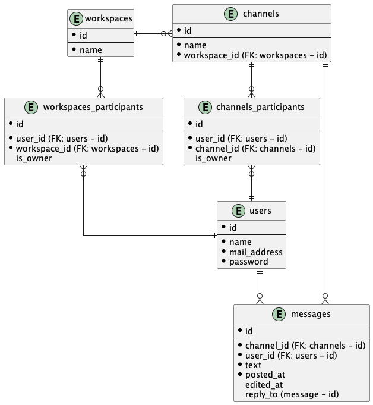

# 解答




## SQL (user_id: u1)
### メッセージ取得 (channel_id: c1)
```
select
  m.user_id,
  u.name,
  m.text,
  m.posted_at,
  m.edited_at
from
  messages m
  inner join (
    select
      channel_id
    from
      channels_participants
    where
      user_id = 'u1'
      and cp.channel_id = 'c1'
  ) cp
    on m.channel_id = cp.channel_id
  inner join users u
    on m.user_id = u.user_id
where
  m.reply_to is null
;
```

### スレッドメッセージ取得 (message_id: m1)
```
select
  m.user_id,
  u.name,
  m.text,
  m.posted_at,
  m.edited_at
from
  messages m
  inner join (
    select
      channel_id
    from
      channels_participants
    where
      user_id = 'u1'
  ) cp
    on m.channel_id = cp.channel_id
  inner join users u
    on m.user_id = u.user_id
where
  m.reply_to = m1
;
```

### 全文検索 (検索キーワード: keyword)
```
select
  m.user_id,
  u.name,
  m.text,
  m.posted_at,
  m.edited_at,
  m.reply_to
from
  messages m
  inner join (
    select
      channel_id
    from
      channels_participants
    where
      user_id = 'u1'
  ) cp
    on m.channel_id = cp.channel_id
  inner join users u
    on m.user_id = u.user_id
where
  m.text like '%keyword%'
;
```


## コメント
- スレッドの扱いが悩ましい
  - messagesからthreadsにテーブルを切り出す想定だった
    - しかし、これをやるとスレッドメッセージ取得と全文検索が難しくなるので断念
    - スレッドメッセージもメッセージだからmessagesでまとめて管理
      - messagesにreply_toのカラムを設けて返信先IDを自己参照

- そのチャネルに所属しているユーザにしか、メッセージ・スレッドメッセージが見えないこと
  - メッセージ・スレッドメッセージを返すSQL内で、channels_participantsをinner joinさせる
    - where句でchannels_participants.user_idを抽出条件にする

- workspace, channelへの参加・脱退
  - workspaces_participants, channels_participantsから対象のuser_idのレコードを物理削除

- 要件に記載なく含めるか迷ったカラム
  - ログイン？
    - mail_address (users)
    - password (users)
  - メッセージ編集？
    - edited_at (messages)
  - workspace, channelへの参加承認？
    - is_owner (workspaces_participants)
    - is_owner (channels_participants)

- その他
  - messagesが巨大なテーブルになりそうなので、SQLの速度は気になる
    - SQLの実行順序(join > where)的にinner joinであらかじめwhereの検索範囲を小さくできそう
      - joinの速度も気になるのであらかじめuser_id='u1'で小さくしたサブクエリで結合
    - インデックスの張り方、そもそものSQLの書き方・・・は気になる
  - リアクションや既読機能があるとごちゃごちゃしそう