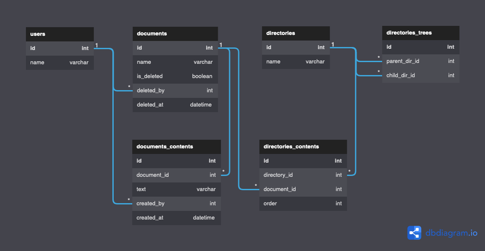

# 解答

## 課題1


```
Table users {
  id   int [pk]
  name varchar
}

Table documents {
  id           int      [pk]
  name         varchar
  is_deleted   boolean
  deleted_by   int      [ref: > users.id]
  deleted_at   datetime
}

Table documents_contents {
  id          int      [pk]
  document_id int      [ref: > documents.id]
  text        varchar
  created_by  int      [ref: > users.id]
  created_at  datetime
}

Table directories {
  id         int      [pk]
  name       varchar
}

Table directories_trees {
  id            int [pk]
  parent_dir_id int [ref: > directories.id]
  child_dir_id  int [ref: > directories.id]
}

Table directories_contents {
  id           int [pk]
  directory_id int [ref: > directories.id]
  document_id  int [ref: > documents.id]
}
```

- directoryの階層構造はdirectories_treesを閉包テーブルとして利用して持たせる。
  - /A/B/Cのようにパスを直接書き下すのは気持ち悪い(アンチパターン？ジェイウォーク調べる)

- documentsにdirectory_idカラムを持たせるか迷ったが、directories_contentsに外出し。
  - documents(ドキュメント一覧)の持つべき情報として、所属ディレクトリは含まれるのだろうか・・・と違和感があった。
  - どちらかと言えば、directoryが持つべきなのではと思った。

- 「いつ、誰が、どんなテキスト情報を保存したのか管理」という要件を、履歴を追えるように・・・と読み取った。
  - (text, created_by, created_at)をdocumentsテーブルに持たせるのではなく、documents_contentsテーブルに履歴として外出し。
  - 画面に返す時はdocuments_contents内ののdocument_id単位で最新のレコードをJOINする。

## 課題2
### ドキュメントの順番


```
Table users {
  id   int [pk]
  name varchar
}

Table documents {
  id           int      [pk]
  name         varchar
  is_deleted   boolean
  deleted_by   int      [ref: > users.id]
  deleted_at   datetime
}

Table documents_contents {
  id          int      [pk]
  document_id int      [ref: > documents.id]
  text        varchar
  created_by  int      [ref: > users.id]
  created_at  datetime
}

Table directories {
  id         int      [pk]
  name       varchar
}

Table directories_trees {
  id            int [pk]
  parent_dir_id int [ref: > directories.id]
  child_dir_id  int [ref: > directories.id]
}

Table directories_contents {
  id           int [pk]
  directory_id int [ref: > directories.id]
  document_id  int [ref: > documents.id]
  order        int
}
```

- directories_contentsにorderを持たせただけ。
  - ドキュメントひとつの順番を入れ替えただけで大量のUPDATEが走るのでは？
    - [teratailの関連質問](https://teratail.com/questions/117201)を見ると意外とそうでもなさそう
      - 元の順番より前に移動: order+1 where ~
      - 元の順番より後に移動: order-1 where ~
      - 別のディレクトリに移動した時も同じ考え方。

### food for thought
Microsoft Plannerのボードでカードの順番入れ替えを行った。
クライアントからのPOSTリクエストを覗くと、OrderHintというパラメータで文字列を送信していた。

[OrderHintに関するdocs](https://docs.microsoft.com/ja-jp/graph/api/resources/planner-order-hint-format?view=graph-rest-1.0)を読んで、以下のように理解。

- OrderHintはカードの表示順序を文字列で持たせたもの
  - 表示順序はa(97) > z(122)
  - たぶん前問のdirectories_contentsでorderを持たせているのと変わらない
- カードの順番を入れ替えた時に起こること
  - 「前後のカードのOrderHint」と「ある規則(空白文字、!記号)」を用いて入れ替え後の位置を表現
  - これをサーバーに送信している
- 一定時間後、サーバー側で新しいOrderHintの値を再計算
  - 一時的な順序変更は「前後のカードのOrderHint」と「ある規則(空白文字、!記号)」でストックするだけ
  - 後からまとめて新しいOrderHintを再計算
  - 順序変更を逐一計算させると負荷が高いから？とても賢い・・・