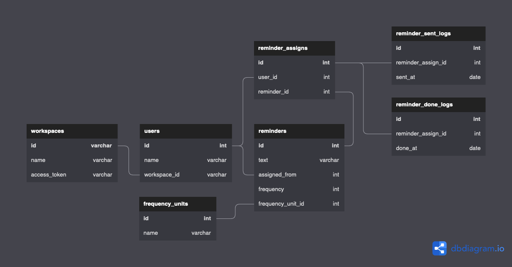

# 解答



```
Table workspaces {
  id varchar [pk]
  name varchar
  access_token varchar
}

Table users {
  id   int [pk]
  name varchar
  workspace_id varchar  [ref: > workspaces.id]
}

Table frequency_units {
  id int [pk]
  name varchar
}

Table reminders {
  id   int [pk]
  text varchar
  assigned_from int [ref: > users.id]
  frequency int
  frequency_unit_id int [ref: > frequency_units.id]
}

Table reminder_assigns {
  id int [pk]
  user_id int [ref: > users.id]
  reminder_id int [ref: > reminders.id]
}

Table reminder_sent_logs {
  id int [pk]
  reminder_assign_id int [ref: > reminder_assigns.id]
  sent_at date
}

Table reminder_done_logs {
  id int [pk]
  reminder_assign_id int [ref: > reminder_assigns.id]
  done_at date
}
```


## 考えたこと
- 送信頻度をどのように持たせるか？
  - 当初はremindersテーブルにregistered_at(リマインダー登録日時; date)とdays(日; int)を持たせようとした。
    - これだと無理orバッチ側のプログラムが複雑になると思った。
      - 毎日とX日おきは簡単だが、毎週X曜日と毎月X日のバッチ抽出が厳しそう。
  - frequency(送信頻度; int)とfrequency_unit(頻度の単位)を持たせる。これらとregistered_atを合わせて見る。
    - 毎日 → {frequency: 1, frequency_unit: day}
    - 3日おき → {frequency: 3, frequency_unit: day}
    - 毎週水曜日 → {frequency: 3, frequency_unit: week}
      - 日〜土(0~6)
    - 毎月3日 → {frequency: 3, frequency_unit: month}

- バッチは1時間ごとに動くが、1日に何回も送信しないためには？
  - remindersテーブルにregistered_at(リマインダー登録日時; date)があるので、この時間部分を見る。
    - 2022-09-09 12:30に登録されたリマインダーは、設定した頻度の12:00のバッチで送信される。
  - バッチリランを考えて、最終送信日時も持たせておきたい。
    - とはいえ、reminderテーブルに最終送信日時を持たせるのはイミュータブルではなさそう。
      - 送信する度にUPDATEがかかる。
    - reminder_sent_logsテーブルでリマインダーごとの送信ログを持たせて、reminder_assign_id単位のsent_atの最新レコード=最終送信日時をチェックできるようにする。