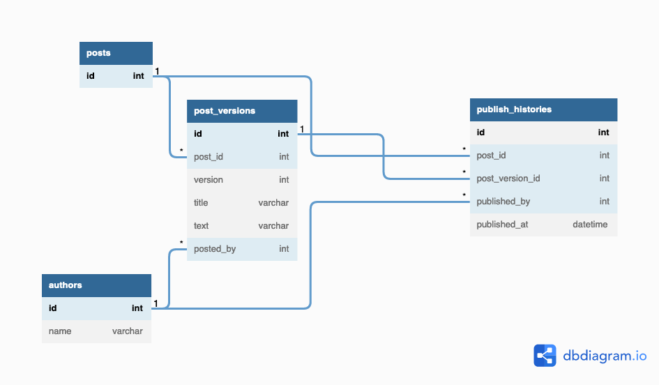
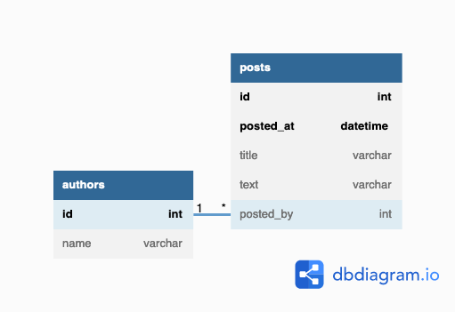

# 解答
## 課題1



（dbdiagram.ioでリレーションの線を手動で動かせたらいいなと思った）

```
Table authors {
  id int [pk]
  name varchar
}

Table posts {
  id int [pk]
}

Table post_versions {
  id int [pk]
  post_id int [ref: > posts.id]
  version int
  title varchar
  text varchar
  posted_by int [ref: > authors.id]
}

Table publish_histories {
  id int [pk]
  post_id int [ref: > posts.id]
  post_version_id int [ref: > post_versions.id]
  published_by int [ref: > authors.id]
  published_at datetime
}
```
- 記事を更新
  - `post_versions`に`version`をインクリメントしてレコードを追加
  - `publish_histories`にレコードを追加

- 記事を表示
  - `publish_histories`の`post_id`単位で`published_at`が最新の`post_version_id`を記事として公開
  
- 履歴の復元
  - `publish_histories`に復元する`post_version_id`を指定してレコードを追加


### 考えたこと
#### `publish_histories`の必要性
- "version"というリソースがあって、"publish"というイベントあるほうが理解しやすいと思った。

## 課題2
### 分析用途のデータ
[参考記事](#ref)を調べた。
- 画面に表示しない(分析用途の)データはElasticSearchやBigQueryなどに突っ込むのが良いとのこと。
  - 分析結果の可視化をしたくなった時に、TableauなどのBIツールと連携も簡単そう。
  - 別のテーブルとJOINは必要か、の部分だけは要検討。

- 課題とは関係ないが、「履歴」と「ログ」の違いが参考になった。
  - 履歴テーブルは画面に表示して ユーザー（利用者）に見せるもの
  - ログテーブルは エンジニア（開発者）などが調査に使用するもの

<a id="alternative"></a>
### 課題1の別解


```
Table authors {
  id int [pk]
  name varchar
}

Table posts {
  id int [pk]
  posted_at datetime [pk]
  title varchar
  text varchar
  posted_by int [ref: > authors.id]
}
```
`posts`だけの場合、履歴から復元すると、タイトルと内容が同じなのに新しいレコードが払い出される。
  - これでも良いのかもしれないが、少々違和感があった。


<a id="ref"></a>
## 参考

1. [履歴テーブルについて](https://user-first.ikyu.co.jp/entry/history-table)
2. [【初心者向け】データベースのテーブル設計で僕が意識している6つのこと](https://qiita.com/himanakuroneko/items/b59336bacf373ac3dfef)

