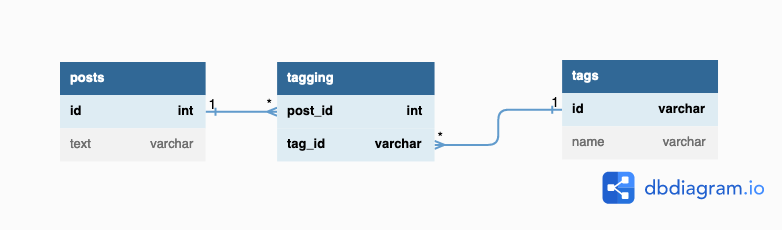

# 解答
## 課題1

1カラムにカンマ区切りのリストを格納するのは、ジェイウォークというアンチパターンに該当する。

「多対多」の関連を表現する交差テーブルの作成を避けようとすると、このパターンに陥る。

(※ジェイウォーク(信号無視)は交差点を避けようとする行為だからこの名前らしい。)

<br />

以下では、例として投稿テーブル(posts)を考えていく。

**例**
```
create table posts (
  id int primary key,
  text varchar(100),
  tag_id varchar(100) -- カンマ区切りのタグIDリスト
);
```

### 何が良くないのか

#### 1. 検索クエリを作りにくい

特定のタグから投稿を検索する場合、正規表現を用いたクエリが必要になる。

例えば、'tag1'というタグIDから投稿を検索するクエリは以下のようになる。

```
select
  *
from
  posts
where
  tag_id regexp '[[:<:]]tag1[[:>:]]'
;
```

正規表現を用いたクエリでは、以下の問題点が挙げられる。
- 式の書き方によっては、意図しない結果が返される可能性がある。
- インデックスを使えない。
- 正規表現を用いた構文はRDBMS製品によって異なるので、ベンダー中立のクエリにならない。

#### 2. JOINが使いにくい

次のタグテーブル(tags)が別にあるとする。

```
create table tags (
  id varchar(10) primary key,
  name varchar(100)
);
```

postsとtagsのJOINを行う際にも、正規表現を用いたクエリが必要になる。

```
select
  *
from
  posts p
  inner join tags t
  on t.tag_id regexp '[[:<:]]' || p.id || '[[:>:]]'
;
```

#### 3. 集約関数が使えない

SQLのcount, sum, avg,...などの集約関数はカンマ区切りのリストではなく、複数のレコードに対して使える。

例えば、投稿ごとのタグの数はcount関数で取得したいが、カンマ区切りのリストに対しては使えない。

#### 4. レコードの更新がしにくい

投稿のタグを追加する場合、次のクエリが考えられる。

```
update
  posts
set
  tag_id = tag_id || ',' || 'tag2'
;
```

このクエリでは以下の問題点が挙げられる。
- タグのソート順を担保できない。
- 同じタグが入ることを防げない(-> 5.妥当性)。
- リストがカラムの最大値(100)を超えた場合にエラーとなる(-> 7.リストの長さ)。

また、タグを削除する場合には、アプリケーション側でカンマ区切りの文字列を書き換えてからUPDATE文を発行する必要がある。SQLだけで更新できないため、アプリケーション側のプログラムが複雑になってしまう。

#### 5. 値の妥当性検証ができない

ユーザーが'tag1'を複数回追加してしまった場合に、例えばtagsのカラムは`tag1, tag1, tag2, tag1`となるが、これはデータベース側でエラーにならない。

また、その他の意味のない値でも入力できてしまうので、データベースはゴミだらけになりうる。

#### 6. 区切り文字が不明確になる

postsの例のように文字列のリストを格納する場合、個々の入力値にも区切り文字(カンマ)が入りうる。

そのため、カンマを区切り文字にしている場合では、入力値としてのカンマなのか、区切り文字としてのカンマなのかが不明確になる。


#### 7. カラムの最大長を超えるリストは格納できない

postsの例では、tag_idカラムはvarchar(100)となっており、この長さを超えるリストは格納できない。

また、将来必要となる長さをvarchar(100)と見積もることも難しい。

## 課題2
### どうすれば防げるのか

中間テーブル(交差テーブル)を作る。

postsの例では新たにtaggingテーブルを作成して、この各レコードにpost_idとtag_idを格納する。

```
create table tagging (
  post_id int not null,
  tag_id varchar(10) not null,
  primary key (post_id, tag_id),
  foreign key (post_id) references posts(id),
  foreign key (tag_id) references tags(id)
);
```

taggingは、以下のようにpostsとtagsの多対多の関連を表現している。


```
Table posts {
  id int [pk]
  text varchar
}

Table tags {
  id varchar [pk]
  name varchar
}

Table tagging {
  post_id int [pk, ref: > posts.id]
  tag_id varchar [pk, ref: > tags.id]
}
```

## 課題3

「多対多」の関連が生まれるサービスには、このアンチパターンが生じうる。

例として考えられるサービスを以下に挙げてみる。

- オンライン学習サービス
  - ユーザー - 授業
- マッチングサービス
  - ユーザー(男) - ユーザー(女)
- 転職サービス
  - ユーザー - スキル

・・・あまり面白い例が浮かばない。

<a id="ref"></a>
## 参考

1. [SQLアンチパターン](https://www.oreilly.co.jp/books/9784873115894/)
2. [交差テーブルには関連の意味を表す名前をつけよう](https://qiita.com/tkawa/items/dc3e313021f32fd91ca6)