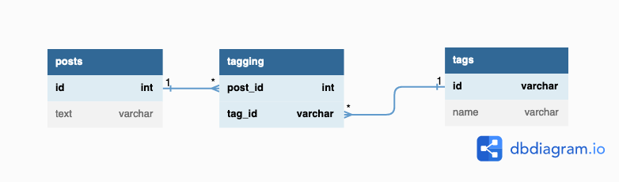

# 解答
## 課題1

複数の値を持つ属性を格納するために、複数のカラムを定義してしまうのは、マルチカラムアトリビュート(複数列属性)というアンチパターンに該当する。

ジェイウォークと同じタイプのアンチパターンで、多対多の関連を表現する時には要注意。

### 何が良くないのか

#### 1. タグの検索が複雑になる

特定のタグから投稿を検索する場合、タグは3列のうちどれにも格納されうるので、3列すべてを取得する必要がある。

```
select
  *
from
  posts
where
  tag1_id = 'タグA'
  or tag2_id = 'タグA'
  or tag3_id = 'タグA'
;
```

AND検索(タグAとタグBの両方のタグがついている…など)では、さらに長いクエリになってしまう。

```
select
  *
from
  posts
where
  (tag1_id = 'タグA'
   or tag2_id = 'タグA'
   or tag3_id = 'タグA')
  and
  (tag1_id = 'タグB'
   or tag2_id = 'タグB'
   or tag3_id = 'タグB')
;
```

#### 2. タグの追加・削除がしにくい

投稿のタグを追加する場合、まずどの列が空いているのかアプリケーション側で確認する必要がある。

```
select
  *
from
  posts
where
  id = 123
;
```

例えば、上記のクエリの取得結果でtag2_idがNULLであると確認できてから、ようやくタグの追加ができる。

```
update
  posts
set
  tag2_id = 'タグC'
where
  id = 123
;
```

#### 3. タグの一意性を保証できない

ユーザーが'タグA'を複数個追加してしまった場合でも、データベース側でエラーにならない。
つまり、複数の列に同じタグが入ることを防げない。

```
insert into
  posts (id, text, tag1_id, tag2_id, tag3_id)
values
  (123, 'アンチパターン2', 'タグA', 'タグA', 'タグB')
;
```


## 課題2
### どうすれば防げるのか

前回(アンチパターン1)と同様に、中間テーブル(交差テーブル)を作る。

postsの例では新たにtaggingテーブルを作成して、この各レコードにpost_idとtag_idを格納する。

```
create table tagging (
  post_id int not null,
  tag_id varchar(10) not null,
  primary key (post_id, tag_id),
  foreign key (post_id) references posts(id),
  foreign key (tag_id) references tags(id)
);
```

taggingは、以下のようにpostsとtagsの多対多の関連を表現している。


```
Table posts {
  id int [pk]
  text varchar
}

Table tags {
  id varchar [pk]
  name varchar
}

Table tagging {
  post_id int [pk, ref: > posts.id]
  tag_id varchar [pk, ref: > tags.id]
}
```

## 課題3


<a id="ref"></a>
## 参考

1. [SQLアンチパターン](https://www.oreilly.co.jp/books/9784873115894/)