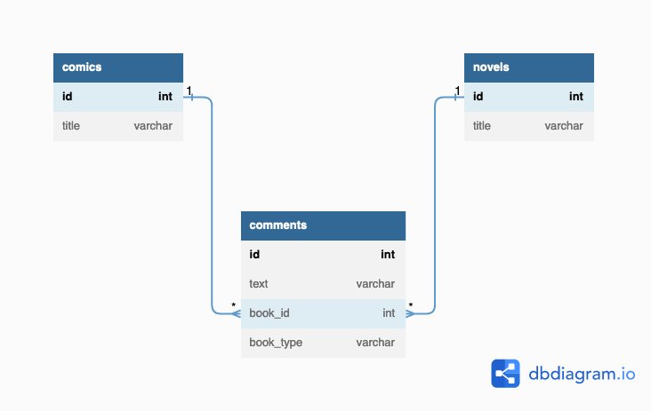
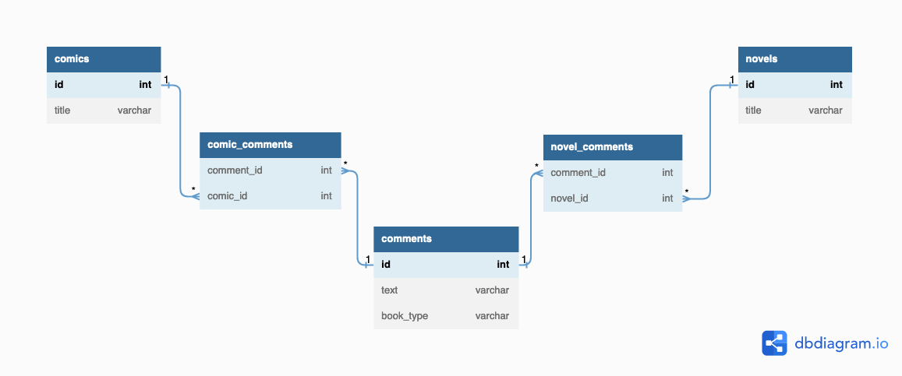
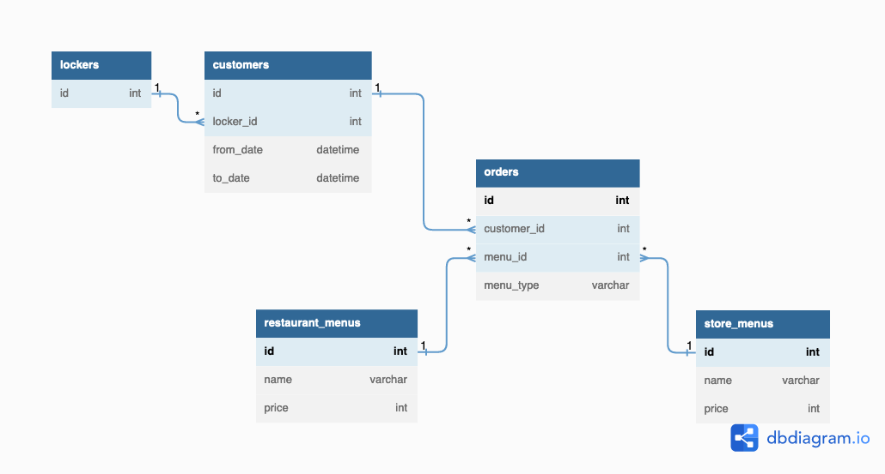

# 解答
## 課題1

ある1つのカラムが複数のテーブルを参照するのは、ポリモーフィック関連というアンチパターンに該当する。

(※アンチパターンというよりは設計パターンなのかもしれない。)

例えば、以下の「漫画(comics)と小説(novels)の両方のコメントを1つのテーブルで持つ」ような場合に起きうる。


```
Table comics {
  id int [pk]
  title varchar
}

Table novels {
  id int [pk]
  title varchar
}

Table comments {
  id int [pk]
  text varchar
  book_id int [ref: > comics.id ,ref: > novels.id]
  book_type varchar
}
```

### 何が良くないのか

#### 1. 外部キーの宣言ができない

外部キー宣言は一つのテーブルのみを指定しなければならないため、1つのカラムが複数のテーブルを参照している状態では、外部キーの宣言ができず参照整合性制約を定義できない。

#### 2. 一覧取得時に全てのテーブルに対してJOINが必要になる

JOIN句では動的に結合するテーブルを指定することができないため、一覧取得時に全てのテーブルを結合する必要がある。

```
select
  t1.id,
  t1.text,
  t1.book_id,
  t1.book_type,
  t2.id as comic_id,
  t2.title as comic_title,
  t3.id as novel_id,
  t3.title as novel_title
from
  comments t1
  left outer join comics t2
    on t1.book_id = t2.id
    and t1.book_type = 'comics'
  left outer join novels t3
    on t1.book_id = t3.id
    and t1.book_type = 'novels'
;
```

| id | text | book_id | book_type| comic_id | comic_title | novel_id | novel_title |
| :---: | :---: | :---: | :---: | :---: | :---: | :---: | :---: |
| 1 | 面白かった | 10 | comics | 10 | マンガ太郎 | `NULL` | `NULL` |
| 2 | つまらなかった | 90 | novels | `NULL` | `NULL` | 90 | ラノベ太郎 |

これにより対象ではない方のJOIN結果にはNULLが入ってしまう。

## 課題2
### どうすれば防げるのか

- 交差テーブルを作成する



```
Table comics {
  id int [pk]
  title varchar
}

Table novels {
  id int [pk]
  title varchar
}

Table comments {
  id int [pk]
  text varchar
  book_type varchar
}

Table comic_comments {
  comment_id int [ref: > comments.id]
  comic_id int [ref: > comics.id]
}

Table novel_comments {
  comment_id int [ref: > comments.id]
  novel_id int [ref: > novels.id]
}
```

交差テーブルから`comments`と`comics / novels`のそれぞれに外部キー宣言を行うことで、参照整合性制約を定義することができる。

一方で、1つのコメントが両方の交差テーブルから呼び出される場合には対処できない。

## 課題3

あるスーパー銭湯では、食堂スペースや売店が併設されており、ロッカーキーの番号に会計をつけるシステムになっている。

この時、以下のように`orders`テーブルの`menu_id`が食堂スペースのメニュー`restaurant_menus`と売店のメニュー`store_menus`の両方を参照するとアンチパターンに陥る。


```
Table lockers {
  id int
}

Table customers {
  id int
  locker_id int [ref:> lockers.id]
  from_date datetime
  to_date datetime
}

Table restaurant_menus {
  id int [pk]
  name varchar
  price int
}

Table store_menus {
  id int [pk]
  name varchar
  price int
}

Table orders {
  id int [pk]
  customer_id int [ref:> customers.id]
  menu_id int [ref:> restaurant_menus.id, ref:> store_menus.id]
  menu_type varchar
}
```

## 参考
1. [SQLアンチパターン](https://www.oreilly.co.jp/books/9784873115894/)
2. [SQLアンチパターン勉強会　第6回：ポリモーフィック関連](https://qiita.com/dai329/items/1db8fbe37f43a465d801)
3. [SQLアンチパターンを読んで （ポリモーフィック関連について）](https://blog.motimotilab.com/sql-anti-pattern-polymorphic-association/)