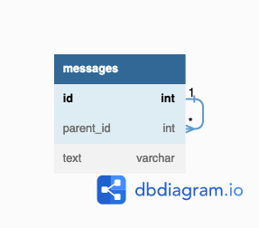
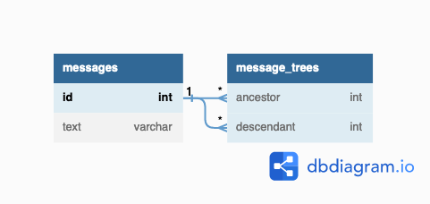

# 解答
## 課題1

直近の親のみを自己参照することでツリー構造を表現するのは、ナイーブツリーというアンチパターンに該当する。

例えば以下のように、親メッセージのIDだけを自己参照することでスレッドを表現する場合が考えられる。


```
Table messages {
id int [pk]
parent_id int [ref:> messages.id]
text varchar
}
```

### 何が良くないのか

#### 1. N階層のツリー構造の取得がしにくい

例として、以下のようなスレッドを考える。

**`messages`テーブル**
| id | parent_id | text |
| :--- | :--- | :--- |
| 1 | `NULL` | 駅前にマックできたらしいよ |
| 2 | 1 | >>1 マックじゃないよ本屋だよ |
| 3 | 1 | >>1 マックじゃないよセブンだよ |
| 4 | 3 | >>3 セブンじゃないよツタヤだよ |
| 5 | 4 | >>4 ツタヤじゃないよサウナだよ |

このスレッドから`id: 1`へのレス(1階層目)を取得するクエリは以下のようになる。

```
select
  t1.*,
  t2.*
from
  messages t1
  left outer join messages t2
  on t1.id = t2.parent_id
where
  t1.id = 1
;
```

階層を深くするだけ`left outer join`の結合が増えるため、階層数が不特定の場合はアプリケーション側で複雑なロジックを持つ必要がある。


#### 2. 非葉ノードを削除した際に整合性を取りにくい

上記の例で`id: 3`などは自身へのレスを持っている(非葉ノード：子を持つノード)。

この場合、`id: 3`を物理削除すると`id: 4`は`parent_id`の整合性を取れなくなってしまうため注意が必要である。(※論理削除ならOK)

## 課題2
### どうすれば防げるのか

- 閉包テーブルで階層を表現する

以下のように、ノードの関係性を平方テーブル`message_trees`で管理する。

閉包テーブルでは、直近の親子関係のみではなく、離れたノードの親子関係や自身を参照するパスも含める。


```
Table messages {
  id int [pk]
  text varchar
}

Table message_trees {
  ancestor int [ref:> messages.id]
  descendant int [ref:> messages.id]
}
```

[### 何が良くないのか]で挙げたスレッドは以下のように表現される。

**`messages`テーブル**
| id | text |
| :--- | :--- |
| 1 | 駅前にマックできたらしいよ |
| 2 | >>1 マックじゃないよ本屋だよ |
| 3 | >>1 マックじゃないよセブンだよ |
| 4 | >>3 セブンじゃないよツタヤだよ |
| 5 | >>4 ツタヤじゃないよサウナだよ |

**`message_trees`テーブル**
| ancestor | descendant |
| :--- | :--- |
| 1 | 1 |
| 1 | 2 |
| 1 | 3 |
| 3 | 4 |
| 4 | 5 |

(--- 具体的なクエリなど書く ---)

- 閉包テーブルのメリット
  - 親子関係を外部キー制約を使って表現するので、整合性が担保できる。
  -  検索や挿入などが少ないクエリで済む。
  -  階層の深さに明確な限界がない。

- 閉包テーブルのデメリット
  - 階層が深くなるごとにそれを表現するためのレコードが増えていく。 
    - ディスクの容量を圧迫する。

## 課題3


## 参考

1. [SQLアンチパターン](https://www.oreilly.co.jp/books/9784873115894/)
2. [SQLアンチパターン　ナイーブツリー ](https://qiita.com/fktnkit/items/57033c10b41b5747dbea)
3. [SQL: ナイーブツリーと閉包テーブルモデル](https://blog.amedama.jp/entry/2016/05/18/234343)