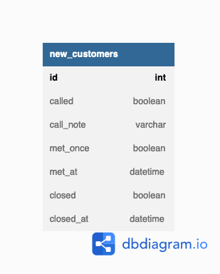

# 解答
## 課題1

新規顧客の営業状況を以下のテーブル`new_customer`で管理する。


```
Table new_customers {
  id int [pk]         -- 顧客ID
  called boolean      -- 電話をかけたか
  call_note varchar   -- 電話の内容
  met_once boolean    -- アポをしたか
  met_at datetime     -- アポをした日時
  closed boolean      -- 成約したか
  closed_at datetime  -- 成約した日付
}
```

例えば、以下のような値が入る。

**`new_customers`テーブル**
| id | called | call_note | met_once | met_at | closed | closed_at | 
| :--- | :--- | :--- | :--- | :--- | :--- | :--- |
| 1 | `false` | `NULL` | `false` | `NULL` | `false` | `NULL` |
| 2 | `true` | 庭にテントを張って暮らしているのは家の鍵をなくしたからとのこと。 | `false` | `NULL` | `false` | `NULL` |
| 3 | `true` | 庭でバーベキューをしたら近所から怒鳴られたとのこと。 | `true` | 2022-10-08 12:00:00 | `false` | `NULL` |
| 4 | `true` | 庭のプールでプリンを作ったら食べきれず腐らせたとのこと。 | `true` | 2022-10-15 12:00:00 | `true` | 2022-10-22 12:00:00 |

### 何が良くないのか

1. アポの数が増えた場合

`met_at`の日時が更新されるため、以下を管理することができない。
- アポを過去何回行なったか
- アポを過去いつ行なったか

2. 過去のアポ日時を知りたい場合

上述の理由から、現状の設計を変えずに過去のアポ日時を保持するためには、新しいレコードを追加する必要がある。

しかし、新しいレコードを追加するということは新しいIDを払い出すということであり、「同じ顧客に対するアポである」ことを別途管理しなければならない。

3. 成約後に解約、その後また成約した場合

`closed`が`true`→`false`→`true`の順に更新される。

現在の成約状況しか管理できないため、「成約後に解約があった」「解約後に再成約があった」という、ビジネス上の何かのヒントになりそうな情報を捨ててしまうことになる。

## 課題2
### どうすれば解決できるか

以下のように顧客(`customers`)というリソースと、電話かけ(`calls`)・アポ(`appointments`)・契約(`contracts`)というイベントに分ける。


```
Table customers {
  id int [pk]
  name varchar
  tel varchar
}

Table calls {
  id int [pk]
  customer_id int [ref: > customers.id]
  note varchar
  called_at datetime
}

Table appointments {
  id int [pk]
  customer_id int [ref: > customers.id]
  note varchar
  appointed_at datetime
}

Table contracts {
  id int [pk]
  customer_id int [ref: > customers.id]
  contract_status boolean
  status_changed_at datetime
}
```

## 課題3

リレーショナルなテーブルでデータを管理できない場合に、このようなことが起きると思う。

MicrosoftのO365環境だけでアプリケーションを作った時に、ライセンスの関係でRDBが使えず、SharePoint Onlineのリスト(Excelのような1つの表形式)にデータを持たせた・・・など(実体験)。