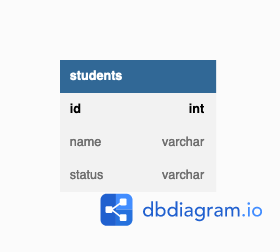
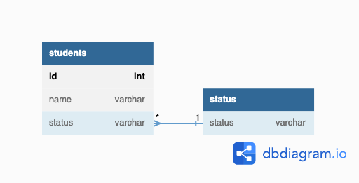

# 解答
## 課題1

学生の「在学中」「卒業」「停学中」などのステータスを以下のテーブルで管理する。


```
Table students {
  id int [pk]
  name varchar
  status varchar CHECK(status IN ("studying", "graduated", "suspended"))
}
```

`status`のカラムには"`studying`", "`graduated`", "`suspended`"のいずれかの文字列しか入らないように、RDBMSのCHECK機能で制約をつける。

### 何が良くないのか

カラムにセットされる値を特定の値に限定したい場合に、その限定される値をカラム定義で指定するのは「サーティーワンフレーバー」というアンチパターンに該当する。

このアンチパターンでは、以下の4つを行う際に弊害を招くおそれがある。

1. 限定される値のリスト取得

`status`が取りうる値のリストを取得したい場合に、以下のSQLを発行することが考えられる。
しかし、この場合には"`studying`", "`graduated`", "`suspended`"の3つすべてがテーブルに存在しないと、取りうる値のリストは取得できない。

```
select
  distinct status
from
  students
;
```

たいていのRDBMSでは、こうしたメタデータ取得のためのシステムビューをサポートしているが、システムビューを使った取得結果をアプリケーション側で利用するのは難しい。

```
select
  name,
  type_desc,
  definition
from
  sys.check_constraints
;
```
**取得結果**
| name | type_desc | definition |
| :--- | :--- | :--- |
| CK_students_status_xxxxxxxx | CHECK_CONSTRAINT | ([status]='studying' OR [status]='graduated' OR [status]='suspended') |

1. 限定される値の追加・削除

> しかし、ENUMの値やCHECK制約を追加または削除するための構文は無く、新たな値セットで列を再定義するしか方法はありません。

SQLアンチパターンには上記のように記載されているが、最新版のMySQLではCHECK制約のDROP、ADDをALTER TABLEで行えるらしい。

2. 限定される値の変更

例えば、上記の例で`studying`を1年生`1st grade`, 2年生`2nd grade`, 3年生`3rd grade`に分けたくなった場合に、既に`studying`がセットされている行はどのようにすればよいか。

- いったん全て`graduated`に変更してから分ける
- `studying`を`NULL`やなんらかのデフォルト値に変更してから分ける

どちらの場合も、変更している間はこれらを画面に返さないように工夫しなければならない。

4. 他のRDBMSへの移植
MySQLではENUMというデータ型を使ってCHECK制約をつけるが、他製品ではENUMがサポートされていないことがあり、移行の際に定義変更にコストが必要になるかもしれない。

### アンチパターンを用いても良いのは
列の値が不変であることが保証されている場合は、定義により入力値を制限してもよい。
右 or 左のような、相互排他的な2つの値はこれに該当すると考えられる。

## 課題2
### どうすれば解決できるか
ステータス`status`は別のテーブルに持たせて、外部キー制約を使う。


```
Table students {
  id int [pk]
  name varchar
  status varchar [ref: > status.status]
}

Table status {
  status varchar
}
```


## 課題3
SQLアンチパターンからの引用。

連絡先の敬称を以下のように設定していたとする。
```
Table personal_contracts {
  ... 他の列 ...
  salutation varchar CHECK(status IN ("Mr.", "Mrs.", "Ms.", "Dr.")) -- 敬称
}
```

ところがある日、会社がフランス支社を設立することになり、"M.", "Mme.", "Mlle."といったフランス語の敬称が新たに必要になってしまった。

## 参考

1. [SQLアンチパターン](https://www.oreilly.co.jp/books/9784873115894/)
2. [SQLアンチパターン勉強会　第十回：サーティーワンフレーバー ](https://qiita.com/aconit96/items/e3e92a69e168009ff64d)
3. [MySQL8.0のCHECK制約を試してみる](https://blog.s-style.co.jp/2020/10/6713/)