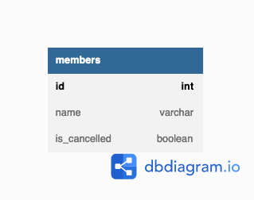
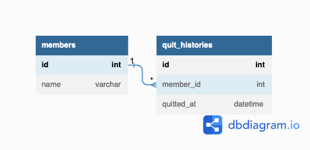

# 解答
## 課題1

あるサービスで会員が退会したか否かを`is_cancelled`フラグに持たせる。
つまり会員が退会した際には、この行は論理削除される。


```
Table members {
  id int [pk]
  name varchar
  is_cancelled boolean
}
```

### 何が良くないのか

1. SQLに常にWHERE句が必要になる

論理削除のフラグをテーブルに持たせることで、そのテーブルからデータを取得する際には常にWHERE句が必要となってしまう。
これによりコード(アプリケーション側も含む？)が削除フラグだらけになって見通しが悪くなる。
```
select
  *
from
  members
where
  is_cancelled = false
```
2. データ量増大やそれに伴うパフォーマンスの劣化

物理削除に比べてテーブルのデータ量は(当然だけど)大きくなる。
これにより検索パフォーマンスは悪くなる。

## 課題2
### どうすれば解決できるか

1. フラグではなく状態で持たせる

'`is_deleted`'のようなフラグではなく、'`status`'のような状態で持たせることが推奨されている。
```
Table members {
  id int [pk]
  name varchar
  status varchar  -- 'active' | 'cancelled' | 'willCancell'
}
```

しかし、これは上記の「1. 何が良くないのか」の解決になっているのか・・・。
結局WHERE句で`status`を指定する必要がありそう。

2. 退会履歴を別テーブルで持たせる


```
Table members {
  id int [pk]
  name varchar
}

Table quit_histories {
  id int [pk]
  member_id int [ref: > members.id]
  quitted_at datetime
}
```

これも「1. 何が良くないのか」の解決になっているのか・・・。
現在アクティブな会員は`quit_histories`を外部結合しないと取得できない。

「退会」という重要なイベントを切り出している点では、1よりも2の方が見やすいと思う。

## 課題3

### 論理削除の存在理由（メリット）

論理削除にしておくと嬉しいケースを以下に挙げる。

- 削除したレコードの履歴を残したい・あとで参照したい
  - 業務的な要件で管理者が削除済みレコードを参照したい
  - システム監査の要件によって削除済みレコードに関する履歴を残したい

- 将来的に必要になるかもしれない
  - 削除済のレコードを利用する要件が発生するかもしれない(YAGNIには反する)
  - エンドユーザーの誤操作でレコードが削除されても、すぐに元に戻せるようにしたい

### ECサイトの注文取り消しは？
注文のレコードを物理削除すると、会計的な問題が発生しそう。
また、例えばAmazonは取り消した注文でも画面から参照できるはず。

### 学習サービスの退会は？
会員のレコードを物理削除すると、管理者が退会した会員の情報を確認したり、累計の会員登録数を確認できなくなる。
また、退会後に再登録するケースがあれば、退会前の情報を利用することになりそう。

### その他のケース
今まで携わってきたWeb会員サイトで、即時の物理削除はあまり行なっておらず、強いて挙げるなら以下のケースだった記憶がある。
- 他システムのレプリケーションデータ
  - 物理削除しても履歴は別のシステムが持ってくれているので問題ない
- システムの機能としてはおまけ程度に利用されるデータ
  - おまけ程度なので履歴を残す必要がない

むしろ、[そのデータ、いつになったら削除しますか](https://zenn.dev/naoto_takaya/articles/9bb8b7b6e1b372)にあるように、論理削除である程度の期間は残しておいて、「いつ物理削除するか」について社内でモメることの方が多かった。

## 参考

1. [SQLアンチパターン 幻の第26章「とりあえず削除フラグ」 ](https://www.slideshare.net/t_wada/ronsakucasual)
2. [「とりあえず論理削除」をやめる](https://qiita.com/kouki_o9/items/4dc3dc955fa9454d7aec)
3. [論理削除と物理削除の違い](https://qiita.com/miyuki_samitani/items/4b7b1ed0202d48171030)
4. [人事関連テーブルについて論理削除にすべきか物理削除にすべきかを検討した](https://note.com/rhayahi/n/nc978c391e0ef)
5. [そのデータ、いつになったら削除しますか](https://zenn.dev/naoto_takaya/articles/9bb8b7b6e1b372)