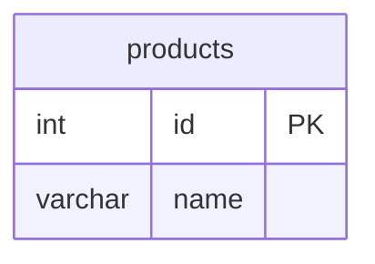
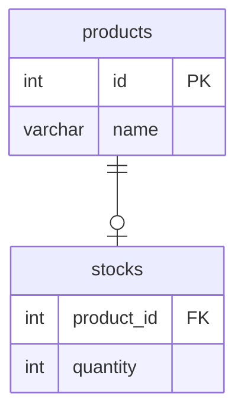
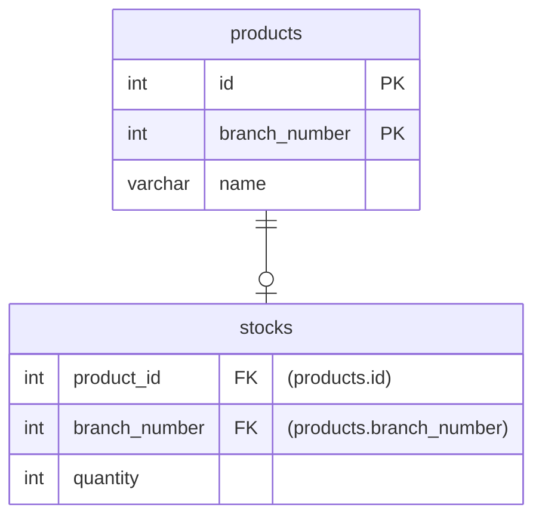
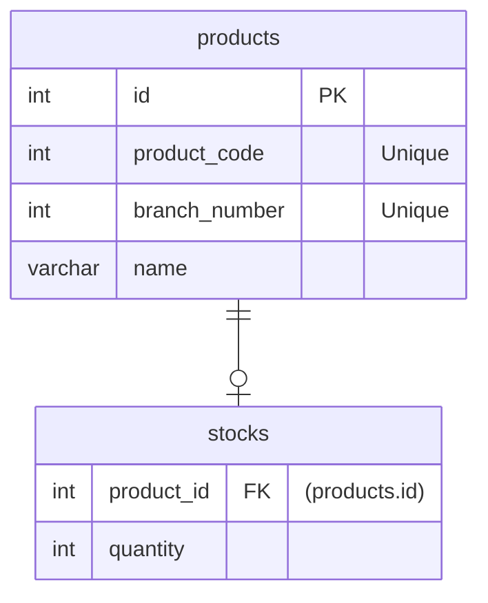

# 解答
## 課題1

ある企業A社が以下のテーブル`products`で商品管理を行っているとする。

例えば、以下のような値が入る。主キーである`id`列には、A社の商品カタログに記載されている`A106`や`F980`のような商品コードが利用される。

**`products`**
| id | name |
| :--- | :--- |
| A106 | ネジ |
| F980 | ボルト |

### 何が良くないのか

上記の例のような主キーを「自然キー(ナチュラルキー)」という。自然キーには**業務的にそのテーブルで行がユニークとなり、キーそのものに意味が含まれる**という特徴がある。

> 例) 社員番号、(証券コード, 日付)の複合主キーなど

 

自然キーを利用することには、一般に次のデメリットがある。

#### ①テーブル間の依存関係を強める
業務の変更により主キーの体系が変化した場合などの影響が大きい(変更に弱い)。

例えば上記の`products`の自然キー(商品コード)を使って、`stocks`で在庫管理を行うことを考える。

ところがある日、ネジの長さが大・中・小に分かれることになったので、`products`テーブルに「枝番(`branch_number`)」を導入することで(`id`, `branch_number`)の複合主キーで商品を扱うことにした。

**`products`**
| id | branch_number| name |
| :---: | :---: | :---: |
| A106 | 1 | ネジ(大) |
| A106 | 2 | ネジ(中) |
| A106 | 3 | ネジ(小) |
| F980 | 1 | ボルト |

これに伴い、`products`の`id`列を参照していた`stocks`のキーも変更の必要が生じる。

このように業務の変更により主キーの体系が変化した際に、自然キーでは他のテーブルへの影響が大きい。
在庫管理`stocks`だけなら楽かもしれないが、通常は注文`orders`など複数のテーブルが`products`を参照することが考えられる。

#### ②WHERE句の条件やJOINがつらい(複合主キーの場合)
   
自然キー(複合キー)の場合、行をユニークにするための項目が増えるためSQLが複雑になる。

特に複合主キーでの結合は条件落ち・条件違いによるバグの温床になりやすい。

## 課題2
### どうすれば解決できるのか

代理キー(サロゲートキー)を使う。

サロゲートキーとは、システム的にそのテーブルで行がユニークとなり、キーそのものに業務的な意味はないもの。例えばオートインクリメントされた連番などがこれにあたる。

サロゲートキーを使って`product`と`stocks`のER図を修正すると、以下のようになる。

自然キーのデメリットの裏返しだが、代理キーのメリットは以下の通り。
- テーブル間の依存関係が希薄になる
  - 業務の変更により主キーの体系が変化した場合などの影響が少ない(変更に強い)。
- WHERE句の条件やJOINが楽になる
  - 1項目だけで行をユニークにできるため。

 

また、代理キーを利用する上での注意点は以下の通り。

- 代理キーでDB設計をするのは「物理設計」のフェーズから。
    - 論理設計の段階では、むしろ自然キーのほうが考えやすい。
        - 論理モデルは業務を反映させたモデル。
        - 物理モデルは実際の実装やインフラに合わせた調整がされたモデル。
            - 物理設計以降で、代理キーを付けることを忘れないように。
- 代理キーを採用したとしても、自然キー部分にはユニーク制約を付与する。
    - ユニーク制約を付けることで業務的なユニーク性を保ちつつ、サロゲートキーの恩恵を得ることができる。

### 主キーに求められる特性

[システムの寿命はコードで決まる！](https://atmarkit.itmedia.co.jp/ait/articles/0606/08/news124_3.html)に記載されていたことが、個人的に分かりやすかったので転載。

> **主キーに求められる特性**
> - 値の変わらないもの
> - できるだけけた数が短いもの
> - 複合キーとなる場合、連結が多くならないもの
> - 必ず存在するもの
> 
> コード体系は変化し得るという前提に立つと、コードは「値の変わらないもの」という特性を損ないます。そして、有意コードであればけた数が長くなりがちなので、「できるだけけた数が短いもの」という特性も損ないます。従って業務で利用するコードはテーブルの主キーとしてはあまり適切ではありません。
> 
> 特に、顧客・受注といったエンティティはほかの多くのテーブルと結合されるため、顧客ID・受注伝票番号といった項目が業務上利用されている場合は、これを顧客・受注といったエンティティでは主キーとしては利用せず、主キーとなる項目をデータベース内に閉じたものとして別途用意すべきです。ただし、参照される機会が少ないような場合は、わざわざ主キー用の項目をシステム内で用意しないという判断も時に必要です

参照される機会がある程度あるなら、代理キーを使っておけば良さそうだと思った。

## 課題3

ある寿司屋では商品テーブルを以下のように設計して、長い間運用していた。

**`sushi`**
| id | name | price |
| :--- | :--- | :--- |
| 1 | マグロ | 200 |
| 2 | サーモン | 100 |

しかし、ある年の異常気象により国内のマグロの価格が高騰したので、海外からもネタを仕入れることにした。

**`sushi`**
| id | country | name | price |
| :--- | :--- | :--- | :--- |
| 1 | Japan | マグロ(国産) | 200 |
| 1 | Jupiter | マグロ(木星) | 100 |
| 2 | Japan | サーモン | 100 |

この業務の変更により`sushi`テーブルの主キーが(`id`, `country`)の複合キーとなり、元々`sushi`を参照していた`orders`などのテーブルに影響が発生してしまった。

## 参考

1. [DB設計について考えてみた。ナチュラルキーとサロゲートキーはどちらが良いのか？](https://amg-solution.jp/blog/8980)
2. [システムの寿命はコードで決まる！](https://atmarkit.itmedia.co.jp/ait/articles/0606/08/news124_3.html)
3. [サロゲートキーと複合主キー | DBFlute (seasar.org)](http://dbflute.seasar.org/ja/manual/topic/dbdesign/surrogatekey.html)