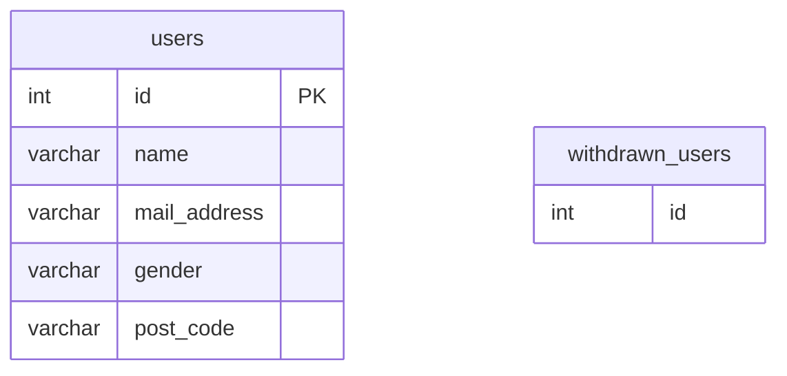

# 解答
## 課題1

あるサービスは以下のユーザーテーブル`users`と退会ユーザーテーブル`withdrawn_users`で会員管理を行なっている。



この時、`users`の各カラムに対してRDBMS側でシステムの仕様を強制するか考える。

### `mail_address`カラムに対して特定のドメインのCheckを使うべきか

Checkはテーブルにデータを挿入・更新する際に、事前に設定した条件を満たすか検証して、もし満たさない場合はエラーにする機能。

例えばメールアドレスを特定のドメイン'@praha-challenge.com'に限定したい場合は、以下のように使う(正規表現が合っているかは不明…)。

```
CREATE TABLE users (
  id int PRIMARY KEY,
  name TEXT,
  mail_address CHECK (mail_address ~* '^[0-9a-zA-Z]*$@praha-challenge.com$'),
  gender TEXT,
  post_code TEXT
);
```

[アンチパターン6の課題](../11_AntiPattern6/README.md)にあったように、これはサーティーワンフレーバーというアンチパターンに該当する。
限定したいドメインが追加・変更されることは十分にあり得るため、`mail_address`にCheckを使うべきではない。

### `gender`カラムに対して性別のEnumを使うべきか

EnumはCheckと同様に、カラムが取る値を限定する機能。

例えば`gender`が取る値を['male', 'female', 'no response']の3択に限定したい場合は、以下のように使う。

```
CREATE TABLE users (
  id int PRIMARY KEY,
  name TEXT,
  mail_address TEXT,
  gender ENUM('male', 'female', 'no response'),
  post_code TEXT
);
```

しかし、この場合でもサーティワンフレーバーに該当すると考えられる。
最近では`gender`は右or左のような相互排他的な概念ではなくなっており、['male', 'female', ?, ..., ?, 'no response']のように、選択肢が増えることは十分にあり得る。

### `users`テーブルからレコードが削除された時(ユーザーの退会時)に`withdrawn_users`にレコードをinsertするTriggerを使うべきか

Triggerは特定のテーブルに対する操作（挿入・更新・削除）があった際に、あらかじめ定義された処理を自動的に実行する機能。

例えば`users`テーブルからレコードが削除された時(ユーザーの退会時)に、削除されたidを`withdrawn_users`にinsertしたい場合は、以下のように使う。

```
DELIMITER $$

CREATE TRIGGER trigger1 AFTER DELETE ON users FOR EACH ROW
 BEGIN
   INSERT INTO withdrawn_users(id) VALUES(old.id);
 END;
$$

DELIMITER ;
```

この例ではTriggerを使うことに特に問題はないように思えるが、[3分でわかるトリガー -使い所と問題点を考える-](https://qiita.com/wanko5296/items/fa3620c48196acbd3ab6)で、Triggerを使う場合の注意点が挙げられている。
 
> - ビジネスロジックの分離による管理範囲の拡大
>   - ビジネスルールを制御するロジックがアプリ側にもデータベース側にも存在することになります。例えば、ビジネスルール変更に伴ってロジックを修正しようとしても、アプリ側だけでなくデータベース側も考慮して修正する必要が出てきます。そして何より、ビジネスロジック全体を理解することが困難になってしまうので、保守性を考えるとおすすめできません。
>   - 自動的に実行される点がトリガーのメリットでもありますが、透過的に実行されるがゆえに開発者から忘れ去られるという危険性をはらんでいます。「なんで勝手にデータ変わってるのこれ？？？」なんてことも起きてしまいそうですね。
> 
> - テーブル間の依存性
>   - トリガーを実装することで、あるテーブルへの操作が他のテーブルにも影響を及ぼすことになります。1つ目の問題点と同様ですが、データベースそれ自体を見ても考慮すべき事項と範囲が増加・拡大することになります。
>   - AテーブルのトリガーによってBテーブルを更新してそれによりCテーブルへのトリガーが...なんてことになってしまうと保守が困難になることは明らかです。
> 
> 上記の問題点は、本来アプリ側で実現可能なアプリロジックを不用意にトリガーで実装した場合に生じるものです。保守性を考慮したうえで設計すれば、運用する中で大きな問題は出ないでしょう。

「保守性を考慮したうえで設計」というのが肝になりそう。

### `post_code`カラムに対してDomainを使うべきか

Domainとはカラムの定義域のこと。

例えば日本の郵便番号`jp_post_code`は「半角数字3桁-半角数字4桁」と取りうる範囲が決まった文字列なので、以下のように使う(たぶん)。
```
CREATE DOMAIN jp_post_code AS TEXT
CHECK(
   VALUE ~ '^\d{3}-\d{4}$'
);

CREATE TABLE users (
  id int PRIMARY KEY,
  name TEXT,
  mail_address TEXT,
  gender TEXT,
  post_code jp_post_code
);
```

`post_code`カラムに対してDomainを使うべきかというと、以下の理由から国内に閉じたサービスであれば問題ないと思う。
- 日本の郵便番号が「半角数字3桁-半角数字4桁」から変わることは考えにくい
  - もし変われば既存のあらゆるシステムに与える影響が大きすぎるのでは
- 一方で海外では別の定義域であることが普通だと考えられる


## 課題2

上記の回答を踏まえると、RDBMSの機能で制約をかけてもいいのは以下の場合に限定されると考えた。
- 制約をかける値に変更がほぼない場合
- 制約そのものが単純で保守性に影響がほぼない場合

それ以外はDBの外部キー制約、もしくはアプリ側で制約のロジックを持つべきだと思う。

## 課題3

あるサービスでは料金計算に誤りが毎月ごく少数だけ発生し、再計算処理後に正しい金額が請求テーブルに連携される。

請求テーブルにはTriggerが仕掛けられており、再計算前後の料金が別テーブルにログとして残る設計になっていたが、設計担当者の退職後、時間とともにTriggerの存在が忘れ去られていた。

そのため、料金計算に誤りのあったレコードを手動で抽出する…という無駄なオペレーションが運用上発生してしまっていた。

## 参考
1. [SQLアンチパターン](https://www.oreilly.co.jp/books/9784873115894/)
2. [SQLアンチパターン：ENUMは使わない方がいいよ](https://shiro-secret-base.com/?p=928)
3. [3分でわかるトリガー -使い所と問題点を考える-](https://qiita.com/wanko5296/items/fa3620c48196acbd3ab6)
4. [Documentation: 14: CREATE DOMAIN - PostgreSQL](https://www.postgresql.org/docs/current/sql-createdomain.html)
5. [Defining a Database Domain](https://www.lifewire.com/database-domain-definition-1019170)
6. [DOMAINを使ってみよう : PostgreSQL Advent Calendar #10](https://nuko-yokohama.hatenadiary.org/entry/20111210/1323463137)